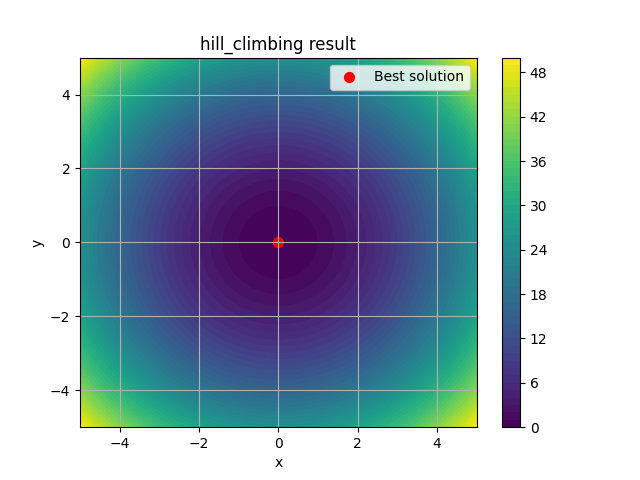
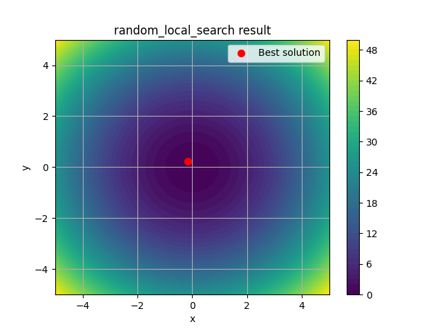
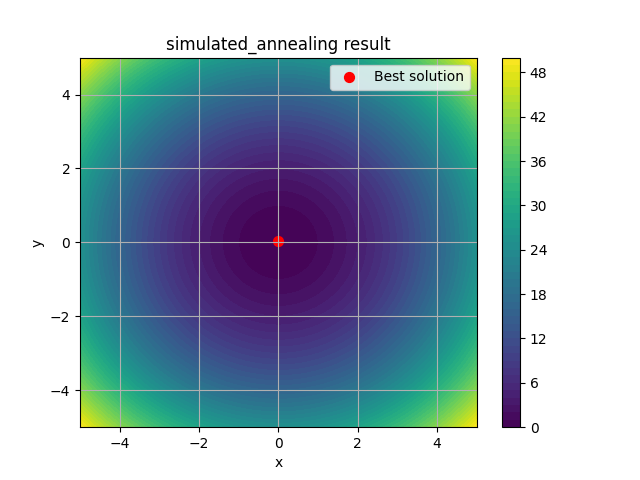
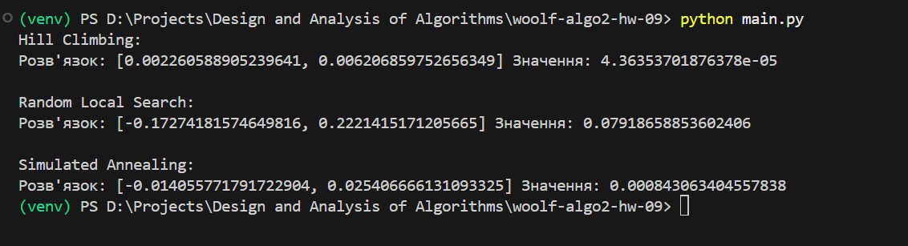

# woolf-algo2-hw-09

# Домашнє завдання 9: Локальний пошук, евристики та імітація відпалу

## 🎯 Мета
Застосування трьох методів локальної оптимізації до функції Сфери: Hill Climbing, Random Local Search та Simulated Annealing.

---

## 🔗 Посилання на репозиторій
[woolf-algo2-hw-09](https://github.com/vikkrat/woolf-algo2-hw-09)

## 📁 Структура проєкту

```
goit-algo2-hw-09/
├── optimization/
│ ├── hill_climbing.py
│ ├── random_local_search.py
│ ├── simulated_annealing.py
│ └── run_all_algorithms.py
├── screenshots/
├── main.py
├── requirements.txt
├── .gitignore
└── README.md

```

---

## ⚙️ Завдання та результати

### 1. Hill Climbing

- Розв’язує задачу локального мінімуму.
- Скрипт: [`optimization/hill_climbing.py`](optimization/hill_climbing.py)
- Результат:


### 2. Random Local Search

- Скрипт: [`optimization/random_local_search.py`](optimization/random_local_search.py)
- Результат:


### 3. Simulated Annealing

- Скрипт: [`optimization/simulated_annealing.py`](optimization/simulated_annealing.py)
- Результат:


---

### Висновки:



- **Hill Climbing** показав найкращий результат серед усіх методів, досягнувши найменшого значення функції `4.36e-05` — алгоритм ефективний, якщо стартова точка вже недалеко від мінімуму.

- **Random Local Search** дав найгірший результат (`0.079`), оскільки не використовує попередню інформацію й повністю покладається на випадок — швидкий, але неточний.

- **Simulated Annealing** продемонстрував компроміс між якістю та дослідженням простору — знайшов точку з непоганим значенням `0.00084`, показуючи стабільну ефективність у складніших ландшафтах.

> 📌 Усі три методи працюють по-різному: **Hill Climbing** швидко сходиться, але легко застряє в локальному мінімумі; **Random Search** — швидкий, але неточний; **Simulated Annealing** — універсальніший і краще обходить пастки.

---

## Інструкція з запуску

### Клонування репозиторію
`git clone https://github.com/vikkrat/woolf-algo2-hw-08.git`
`cd woolf-algo2-hw-08`

# Створення та активація віртуального середовища
`python -m venv venvv
`source venv/bin/activate`  # або `venv\Scripts\activate` на Windows

### Встановлення залежностей
`pip install -r requirements.txt`

### Запуск 
`python optimization/run_all_algorithms.py`
`python main.py` # для побудови графіків

---